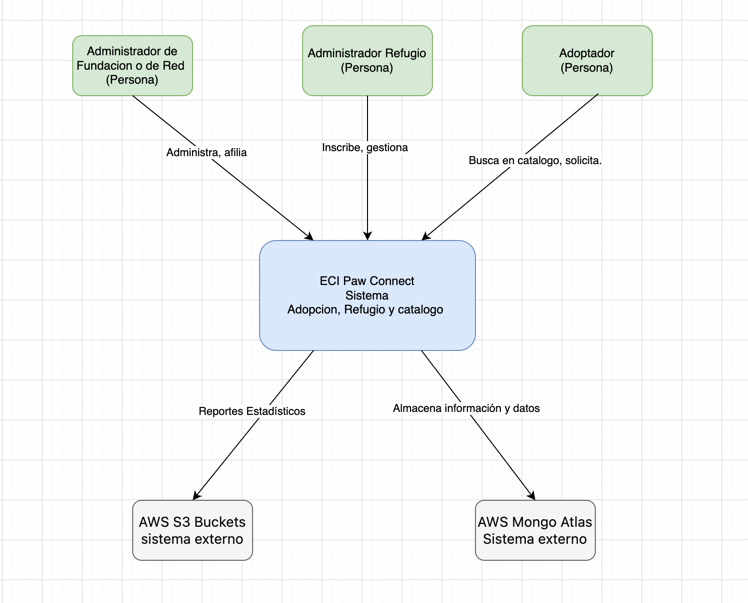
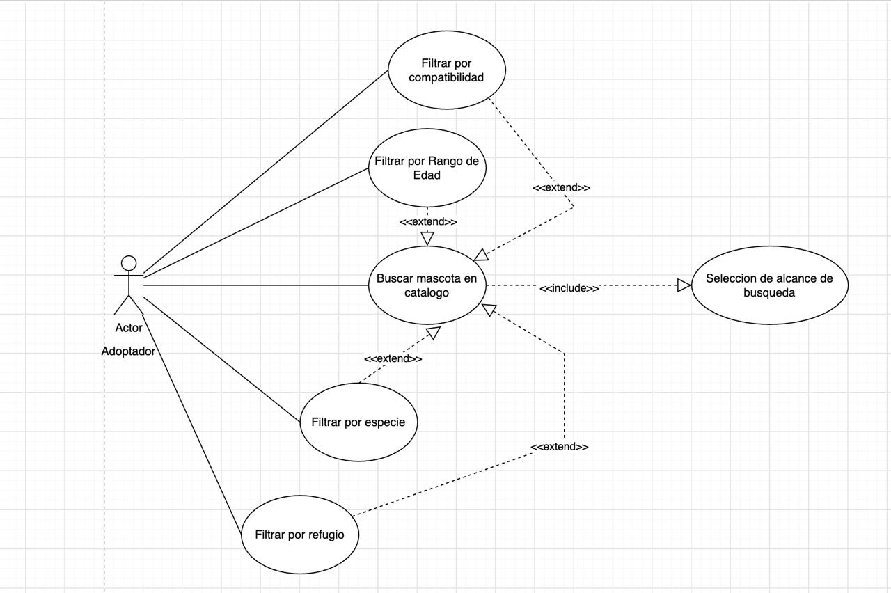
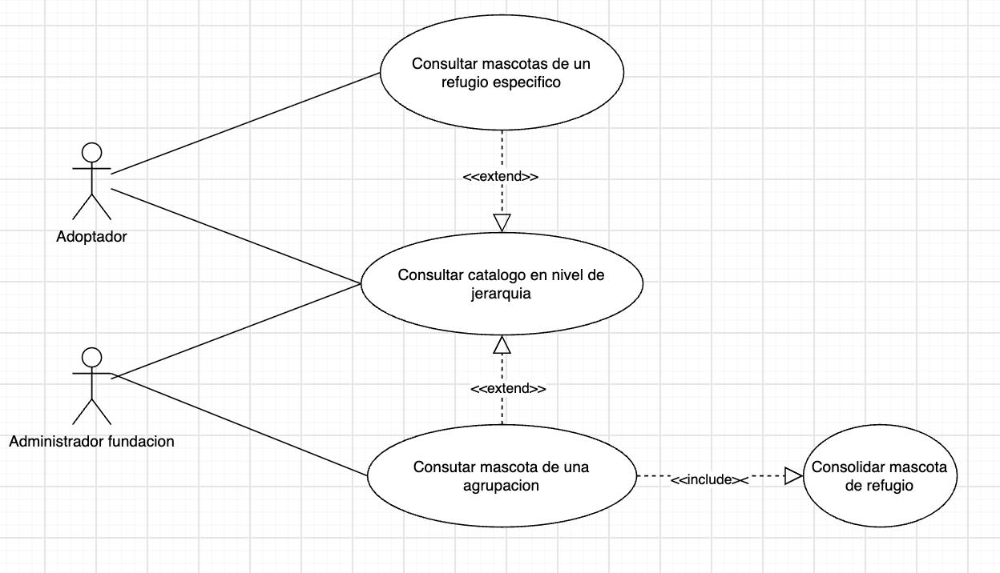
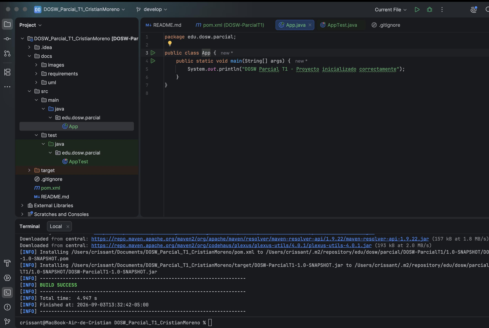
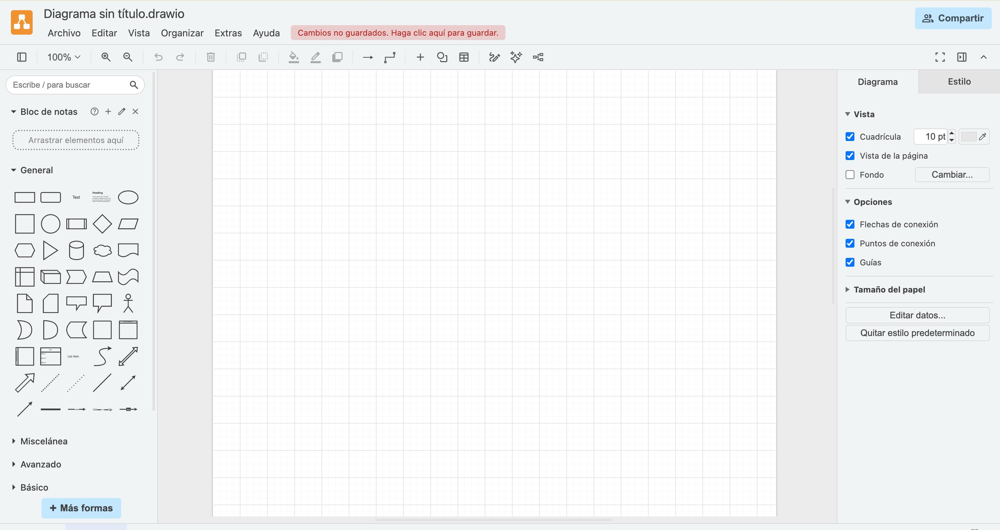
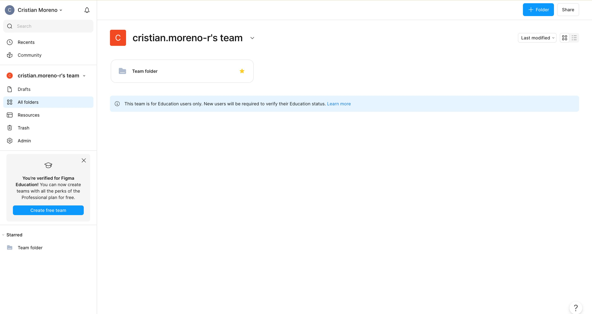

# DOSW_Parcial_T1_CristianMoreno

**Nombre completo:** Cristian Moreno  
**Grupo DOSW:** DOSW-1  

## Punto 1
## 1. Diagrama de Contexto

### Generalidades del sistema

ECI Paw Connect es una plataforma que digitaliza el proceso de adopción de mascotas de la
fundación Paw Connect. El sistema se encarga de gestionar un catálogo distribuido en una estructura jerárquica
de refugios aliados de la forma : Red Nacional → Ciudad → Refugio, donde cada refugio contiene las
mascotas disponibles segun los filtros de busqeuda. La plataforma permite recorrer cualquier nivel de esa jerarquía de forma
transparente, tratando un refugio individual y la red completa de la misma manera, por otro lado ofrece
distintas formas de recorrer el catálogo (filtros), por especie, por rango de edad, por compatibilidad o
por refugio. Cada solicitud de adopción avanza por los estados: PENDIENTE → EN_REVISIÓN → APROBADA / RECHAZADA → COMPLETADA.

La información se persiste o almacena en AWS Mongo Atlas y los reportes estadísticos se publican en AWS S3 Buckets.

### Diagrama de contexto realizado en draw.io:

### Actores identificados

Los actores identificados son:
- **Adoptador .** Es el usuario final de la plataforma, el cual explora el catálogo filtrando por especie,
  rango de edad, compatibilidad o refugio, dependiendo tambien del refugio y registra su solicitud de adopción.

- **Administrador de Refugio.** Adminsitra sobre un único refugio. Inscribe en el catálogo las mascotas
  de su refugio con sus atributos mencionados y hace avanzar el estado de las solicitudes que recibe, llevándolas del 
  estado incial al final.

- **Administrador de la Fundación/Red.** Opera sobre la red completa, donde afilia nuevos refugios, organiza
  la jerarquía agrupándolos por ciudad y consulta los reportes consolidados de toda la red a traves de los actores externos.

### Sistemas externos

- **AWS MongoDB Atlas.** Almacena la información de mascotas, refugios y solicitudes de adopción.

- **AWS S3 Buckets.** Almacena los reportes estadísticos que genera el sistema.

## Punto 2

## 2. Requerimientos del Sistema

### Requerimientos Funcionales

**RF-01 Consultar el catálogo en cualquier nivel de la jerarquía de refugios**

ECI Paw Connect debe tener la capacidad de poder permitir consultar el catálogo de mascotas sobre
cualquier punto de la jerarquía de refugios, mediante la misma operación. Al consultar un refugio, el sistema debe
devolver solo las mascotas de ese refugio, al consultar una ciudad o la red nacional, debe
devolver la consolidación de las mascotas de todos los refugios que contiene en cualquier nivel de
profundidad. 

*Patrón asociado al requerimiento: **Composite**. Un refugio (como hoja) y una agrupación de refugios (como compuesto)
exponen la misma interfaz, de forma que el cliente los trata de manera uniforme y la jerarquía puede crecer sin impacto
sobre las consultas realizadas.

**RF-02  Recorrer el catálogo con múltiples criterios de búsqueda**

ECI Paw Connect debe tener la capacidad de permitir al Adoptador recorrer el catálogo de mascotas
aplicando uno de los siguientes criterios de búsqueda mencionados previamente: por especie, por rango de edad en meses, por
compatibilidad o por refugio. El sistema devuelve el resultado

*Patrón asociado a este requerimiento: **Iterator**. Cada criterio se implementa como un iterador concreto que expone la
misma interfaz de recorrido, lo que permite intercambiar la forma de navegar el catálogo e  incorporar nuevos criterios 
sin modificar al cliente que consume los resultados.

**RF-03 Registrar mascotas en el catálogo de un refugio**

ECI Paw Connect debe tener la capacidad de permitir al Administrador de Refugio poder inscribir una
mascota en el catálogo de su refugio asocidado, dionde registra su número de identificación, nombre, especie, 
edad en meses, tamaño y sus tres indicadores de compatibilidad: con niños, con otras mascotas y con espacios reducidos. 
El sistema debe rechazar el registro cuando el número de identificación ya exista en la red o cuando alguno de
los atributos obligatorios esta ausente, e informar al administrador la causa del rechazo de la operación.

### Requerimientos No Funcionales

**RNF-01 — Rendimiento de las búsquedas**

El sistema deberá resolver y responder cualquier consulta sobre el catálogo en un tiempo máximo de 1 segundo para el 90% 
de las peticiones, bajo condiciones normales de operación, incluyendo  aquellas búsquedas que recorren la totalidad de la 
red nacional.

**RNF-02 — Escalabilidad del catálogo**

El sistema deberá soportar hasta 10.000 mascotas registradas distribuidas en la jerarquía de
refugios,de acuerdo a lo expuesto en el RFN-01 manteniendo el mismo comportamiento en las operaciones de recorrido y consulta.

## Punto 3

### Historias de Usuario

#### HU-01 — Asociada a RF-01 (Patrón Iterator)

* Como Adoptador, quiero recorrer el catálogo de mascotas aplicando distintos criterios de búsqueda (por especie,
por rango de edad, por compatibilidad o por refugio de origen), para encontrar de forma rápida las mascotas que se ajustan 
a las condiciones de mi hogar.

#### HU-02 — Asociada a RF-02 (Patrón Composite)

* Como Administrador de la Fundación, quiero consultar el catálogo sobre cualquier punto de la jerarquía de refugios
usando la misma operación, sin importar si es un refugio individual o una agrupación, para conocer la disponibilidad de 
mascotas tanto de un refugio puntual como de una ciudad o de la red completa.

* Como Adoptante, quiero consultar las mascotas disponibles eligiendo si busco en un refugio específico o en toda la red 
nacional, para poder decidir si adopto cerca de mi ciudad o si amplío la búsqueda a otras regiones cuando no
encuentro una mascota compatible a mis intenciones.

## Punto 4
# RF-01 — Recorrer el catálogo con múltiples criterios de búsqueda

**Código** RF-01

**Patrón asociado**  Iterator, comportamiento

## Nombre
Recorrer el catálogo con múltiples criterios de búsqueda.

## Descripción
El sistema permite al Adoptadore recorrer el catálogo de mascotas de la red de refugios aplicando uno
de cuatro criterios de búsqueda: por especie, por rango de edad en meses, por compatibilidad o por
refugio de origen.

## Cómo se ejecutará

El Adoptador ingresa a la pantalla de búsqueda del catálogo, selecciona el alcance sobre el que
desea buscar que puede ser un refugio, una ciudad o la red nacional, elige un criterio de búsqueda, diligencia
los valores que ese criterio requiere y ejecuta la consulta que quiere. El sistema recorre el catálogo del
alcance seleccionado mediante el iterador  correspondiente al criterio y presenta los resultados a la busqueda.

## Actor principal
Adoptador.

## Precondiciones
- Debe existirr al menos un refugio registrado en la jerarquía.
- El catálogo debe contener al menos una mascota registrada.

## Datos de entrada
- Alcance de la búsqueda (refugio, ciudad o red nacional).
- Criterio de búsqueda seleccionado.
- Valores del criterio, según cuál se haya elegido:
- Por especie: PERRO, GATO, CONEJO, AVE o REPTIL.
- Por rango de edad: edad mínima y edad máxima, en meses.
- Por compatibilidad: compatible con niños, con otras mascotas y con espacios reducidos (sí/no cada uno).
- Por refugio de origen: nombre del refugio.

## Datos de salida
- Listado de mascotas que cumplen el criterio, cada una con su identificador, nombre, especie, edad,
  tamaño y refugio de origen.
- Total de mascotas encontradas.

## Flujo básico
1. El Adoptador abre la pantalla de búsqueda del catálogo.
2. El sistema muestra los alcances disponibles y los cuatro criterios de búsqueda.
3. El Adoptador selecciona el alcance de la búsqueda.
4. El Adoptador e selecciona un criterio de búsqueda.
5. El sistema despliega los campos correspondientes a ese criterio.
6. El Adoptador diligencia los valores y ejecuta la búsqueda.
7. El sistema recorre el catálogo del alcance seleccionado con el iterador del criterio elegido.
8. El sistema muestraa el listado de resultados y el total encontrado.

## Flujo alterno
- Sin resultados .En el ultimo paso, si ninguna mascota cumple el criterio, el sistema muestra
  un total de 0 y un mensaje que indica que no se encontraron coincidencias con la busqueda, sugiriendo ampliar el
  alcance o cambiar los valores del filtro para poder encontrar
- Rango de edad inválido, si la edad mínima es mayor que la máxima, el
  sistema no ejecuta la búsqueda e indica junto al campo que el rango no es válido.

## Reglas de negocio
- Solo se muestran en los resultados las mascotas que se encuentran disponibles para adopción.
- La edad de las mascotas se maneja siempre en meses.
- Las especies son las unicas que ya estan registradas.
- El alcance de busqueda ya esta estipulado en la jerarquia, no deben habver mas opciones.
## Historial de Revision

- Elaborado por: Cristian Moreno Ruiz
- Fecha : 03/09/2026
- Descripcion y justifiacion : Basadome en lo estiuplado en los pasos anteriores, se hace el analisis por
  cada unad de las partes y puntos de la plantilla que fue adjuntada en la herramienta Teams. Se logra hacer el
  analiss por cada punto

# RF-02 — Consultar el catálogo en cualquier nivel de la jerarquía de refugios

**Código**  RF-02

**Patrón asociado**  Composite , estructural

## Nombre
Consultar el catálogo en cualquier nivel de la jerarquía de refugios.

## Descripción
El sistema permite consultar el catálogo de mascotas sobre cualquier punto de la jerarquía de
refugios mediante la misma operación, sin que quien consulta deba distinguir si el punto es un
refugio individual o una agrupación de refugios.

## Cómo se ejecutará

El usuario ingresa a la pantalla de exploración de la red, donde se presenta la jerarquía Red
Nacional, Ciudad ,Refugio. Selecciona el que quiere consultar y el sistema devuelve el
catálogo correspondiente la seleccion.

## Actor principal

Administrador de la Fundación.

## Actores secundarios

Adoptador.

## Precondiciones
- El usuario se encuentra en la pantalla de exploración de la red.

## Datos de entrada
- Punto de la jerarquía seleccionado.

## Datos de salida
- Nombre y tipo del punto consultado.
- Listado consolidado de las mascotas del nodo, cada una con su identificador, nombre, etc.
- Total de mascotas encontradas en el nodo.

## Flujo básico

1. El usuario abre la pantalla de exploración de la red.
2. El sistema muestra la jerarquía de refugios en forma de árbol navegable.
3. El usuario selecciona un nodo de la jerarquía.
4. El sistema identifica el nodo seleccionado y solicita su catálogo.
5. Si el nodo es un refugio, el sistema devuelve las mascotas registradas en él.
6. Si el nodo agrupa a otros, el sistema consolida de forma recursiva las mascotas de todos sus
   descendientes.
7. El sistema muestra el listado consolidado y el total de mascotas del nodo.

## Flujo alterno

- Punto de jerarquia sin mascotas, si el punto consultado no contiene mascotas ni
  directamente ni a través de sus descendientes, el sisitema no muestra nada.
- Nodo agrupador vacío. si el nodo agrupador no contiene refugios ni
  subagrupaciones, el sistema devuelve un total de 0 sin generar error.

## Reglas de negocio

- Un refugio pertenece a una única ciudad y una ciudad pertenece a una única red.
- El total de mascotas de un punto agrupador equivale a la suma de los totales de todos los nodos que
  contiene.
- La consulta se comporta igual sobre un refugio que sobre una agrupación, y devuelve el mismo tipo
  de resultado para cada una de las busquedas.
- Se puede consultar sobre cualquier punto y se debe obtener la misma informacion en todos.

## Historial de Revision

- Elaborado por: Cristian Moreno Ruiz
- Fecha : 03/09/2026
- Descripcion y justifiacion : Basadome en lo estiuplado en los pasos anteriores, se hace el analisis por
  cada unad de las partes y puntos de la plantilla que fue adjuntada en la herramienta Teams. Se logra hacer el
  analiss por cada punto

## Herramientas

- **Modelado:** Draw.io
- **Diseño de interfaces:** Figma

---

## Evidencias de acceso previo al parcial

### Ejecución con Maven

### Acceso a herramienta de modelado

### Acceso a Figma

